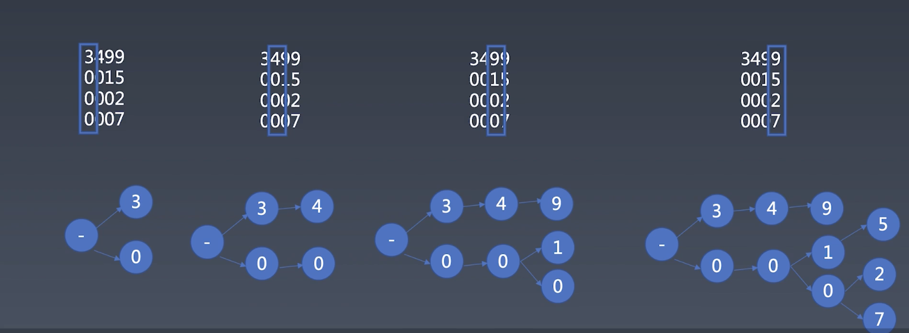

学习笔记

本周课程主要三个内容：字典树、KMP、wildcard
### 字典树
* 字典树：**大量高重复**字符串的存储与分析   
在 js 中最适合存字典树的数据结构是 Object 或 map。因为键都是字符串，所以用对象就好了。
字典树类似于一种查字典的过程，先去看第一个字母属于字典中的哪一部分，之后再看第二个字母属于字典中的哪一部分，不断重复，直到找到完整的字符。   
把查字典的行为变成一个树形结构，就是字典树。如何生成字典树如下图所示：   
    

1. 首先是字符串的插入：将一个字符串插入字典树中。   
从root将字符串逐级的放入字典树中。过程如下：
从字典树的根级 root 开始查找，`let node=root;`   
遍历要插入的字符串 word，`for(let c of word)`   
对于 word 中的每一个字符 c，如果在字节点中没有找到  c，则先创建这个节点 `if(!node[c]) node[c]=Object.create(null)`   
之后再到 c 对应的节点的下一层继续查找 `node=node[c]`    

插入结束之后，要给该字符串加一个截止符，如   '$'，因为 '$' 本身也是一个字符，为了避免重复，使用 symbol ` let $ = Symbol('$')`。   
在遍历结束后，查找一个是否已存在截止符，若不存在，则创建一个。若存在，则使其对应的值加一。
```
if(!$ in node)  node[$]=0;
node[$]++;
```
所以截止符对应的值是该字符串出现的个数。这对于查找字典树中存在最多的字符串很有用。

2. 查找字典树中存在最多的字符串
主要是根据截止符对应的node的值是该字符串出现的个数来进行判断。
### KMP
KMP:在长字符串(source)里找模式(pattern)，即检查一个长字符串里是否有一个短的字符串，是一个部分匹配   
KMP与字典树的区别：字典是检查两个字符串完全匹配，而KMP是检查一个字符串是否是另一个的部分   
暴力求解：对于父串中每一个字符都去匹配一下，时间复杂度：m*n     
KMP：时间复杂度：m+n   
规律：当一个字符串具有自重复性的时候，去匹配这个字符串就可以减少在父串中匹配的步数   
对于KMP算法，第一步是得到PMT(部分匹配表格  table)，即看模式串是否有自重复性；   
第二步：拿着部分匹配表格 table 去进行source与pattern的匹配   
这两步其中关键性的步骤是相似的：即当摸一个字符匹配不成功时，不用直接回退到第一个字符，去查看该字符前面pattern有几个自重复字符（j)，回退到table[j]即可。

### wildcard
wildcard: 带通配符的字符串模式
加入了两种通配符（* ?）
1. *: 匹配多个任意字符
最后一个 * 会尽量多的匹配，前面的 * 都是尽量少的匹配
2. ?: 匹配一个任意字符

另外 wildcard 还有一个特殊的点：开头和结尾的部分一定要准确的匹配。即第一个 * 前，和最后一个 * 后的部分。
所以思路即：先查找出 * 的个数。如果没有 * ，那么模式串和原串要精确匹配。
若存在 *  ，那么开头和结尾要精确匹配。   
中间部分采用正则表达式，每一个 *  之前的部分为一个子模式串，并将其中的问号替换为任意字符,作为一个正则表达式去进行匹配，
记录下匹配上的的位置lastIndex,从这个位置开始去匹配下一个 * 的部分。
